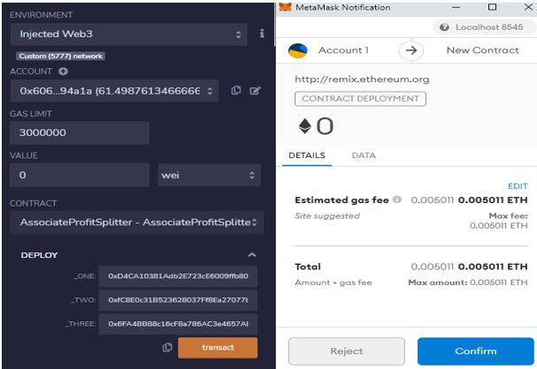

# Solidity Homework_20

## AssociateProfitSplitter Contract
This contract is used to send the amount to three different address of employees equally, and the remainder to be sent to the deployer if any exists.
The contract was tested and below are the screenshots to prove

### Initiate the contract

### Finalize the contract by submitting 10 ETH split equally

