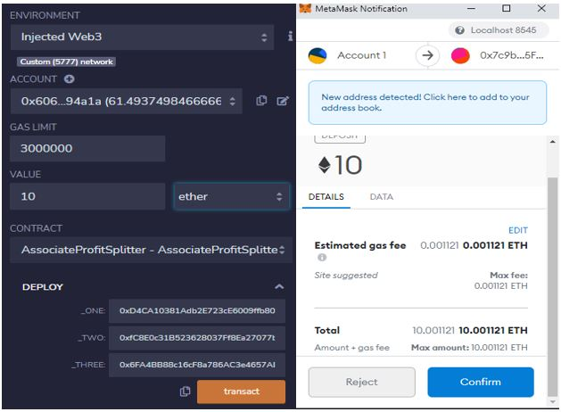

# Solidity Homework_20

## AssociateProfitSplitter Contract
This contract is used to send the amount to three different address of employees equally, and the remainder to be sent to the deployer if any exists.__
The contract was tested and below are the screenshots to prove it

### Initiate the contract

### Finalize the contract by submitting 10 ETH split equally

## TieredProfitSplitter Contract
This contract is used to three employees with different ratio (CEO 60%, CTO 25%, and Bob 15%)
If any remainder amount left it was going to be transferred to the CEO with highest percentage of 60%
The Contract was tested and below are the screenshots to prove it

### Initiate the contract

### Finalize the contract by submitting 15 ETH split between three employees

## DeferredEquityPlan Contract
This contract is used to distribute shares to an employee
Each employee will receive 250 shares per year to the maximum of 1000 shares
The employee will be able to access those shares once a full year is passed
To test the contract we created another function "fastforward" to increase the number of days passed by 100, and after 4 fastforward function call, meaning overall 400 days passed the distribution of 250 shares can been seen

The contract was test and below are the screenshots to prove it

### Initiate the contract

### Finalize the contract by calling function "Fastforward" 4 times

